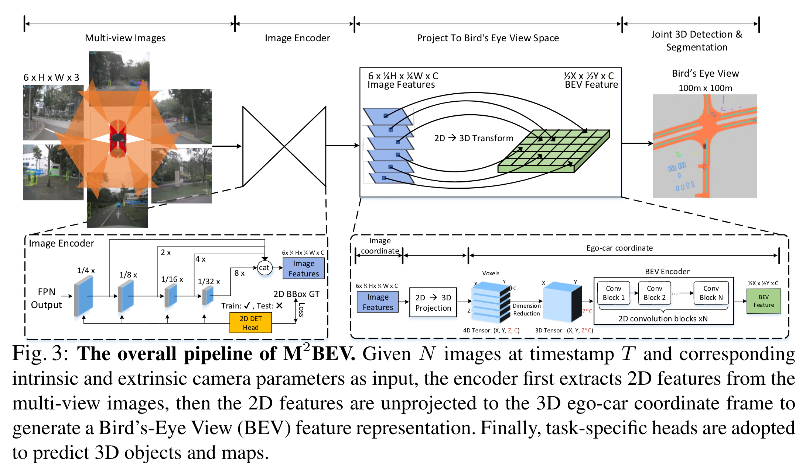
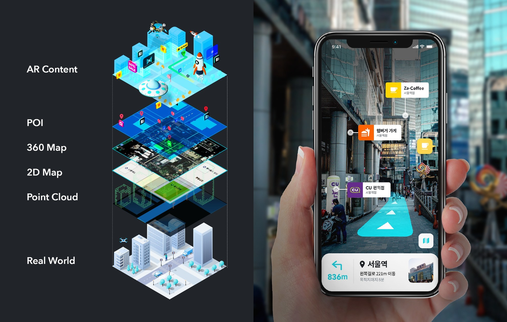
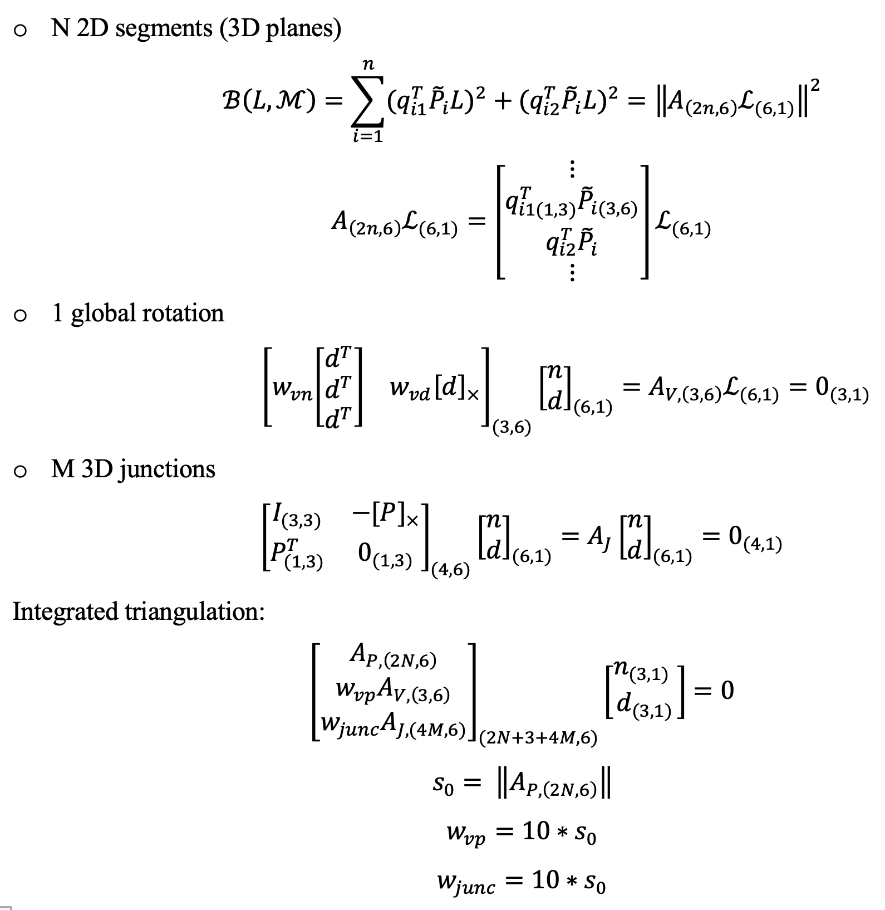
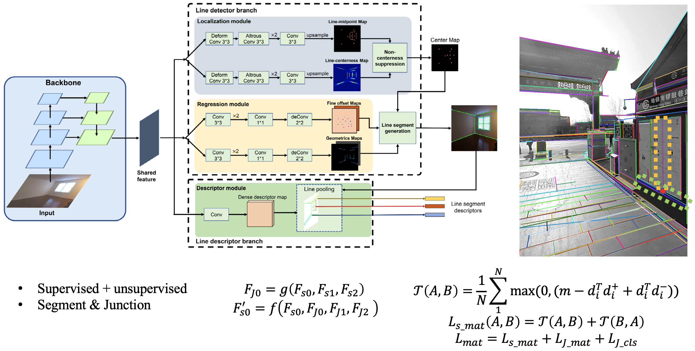

# Yongzhi
Computer vision researcher and engineer with 5 years’ academic and 4 years’ industry experience. I have
developed several popular products on TikTok and CapCut at ByteDance. I am currently working on 3D
reconstruction and scene understanding as the team lead of mixed reality (MR) group in Tencent XR AU-Lab.
I love coding and have been programming using C++ and python for around 9 years. I am passionate on
pursuing excellence, embracing challenges, enjoying work with others, learning new things along the way.

# Dense 3D reconstruction and scene understanding for VR headset 
**Tencent， Canberra Australia**  
**Senior researcher in computer vision, Team lead of Mixed Reality (MR) group**

- Roadmap of MR: I have designed the first roadmap of MR for Tencent XR AU-Lab based on a
comprehensive evaluation of SOTA methods in stereo depth, multi-view stereo(MVS) and depth fusion. I
proposed a pyramid and structural-aware plane sweep MVS approach, which achieves 40FPS and is 3 times
faster than the SOTA method SimpleRecon.

- 3D scene understanding: I am leading the development of a 3D scene understanding system similar to
Apple’s RoomPlan for MR, which detects 3D objects real-time from RGB-D images.

|  Input video |  Multi-view stereo reconstruction |  3D scene understanding |
| :-----| :----: | :----: |
|    |      |     |

## General plan detection

|  Input point cloud |  Plane detection |  Input point cloud |  Plane detection |
| :-----| :----: | :----: | :----: |
|    |      |     |     |

## BEV room layout detection
|  Input point cloud |  Plane detection | 
| :-----| :----: | 
|    |      | 

# AR (Augmented reality) Cloud 

## Structure from motion (SFM) of 3D line map

Key contributions:
1. A novel 3D mapping pipeline.   
2. Multi-view triangulation using Plucker representation.   
3. No Manhattan assumption

|  High-precision map for AR |  The pipeline of proposed 3D line mapping approach.|
| :-----| :----: |
|    |     |
| |  |

| |   |   |
| ----------- |  ----------- | ----------- |
| 3D point cloud |  |       |
| 3D line cloud |   |    |
| Reprojections |  |  | 

## Visual positioning system combining features of point and line  
Key contributions: 
- A novel geometric & descriptor fused line matching approach based on coarse VPS pose.

|  VPS (Visual Positioning Service) |  The pipeline of proposed line-based pose verification & refinement.|
| :-----| :----: |
|  ||
|  ||

## 3D surface detection from a single view  

Multiple 3D surfaces are detected from a single view.
- No Manhattan assumption
- Unknown camera models 
- 3D normal accuracy > 97% in real world images (around 60% accuracy achieved by SOTA learning and handcrafted methods.)

### Wrap virtual materials on the 3D surfaces:  

| | |
| :-----| :----: |
| 1. Fully automated and real-time generation of multiple 3D planes from a single view.   2. The layout of multiple planes are optimized based on the scores and distribution of 3D planes.  |  |

## Scan-to-BIM  
- Input: registered point cloud
- Output: building information models (BIM), which are 3D objects with semantic and structural information.

### FloorDet  

|  |  |
| :-----| :----: |
|  |   |
|  |   |
|  |   |

### CorDet  

|  |  |
| :-----| :----: |
|  |   |
|  |   |
|  |   |
