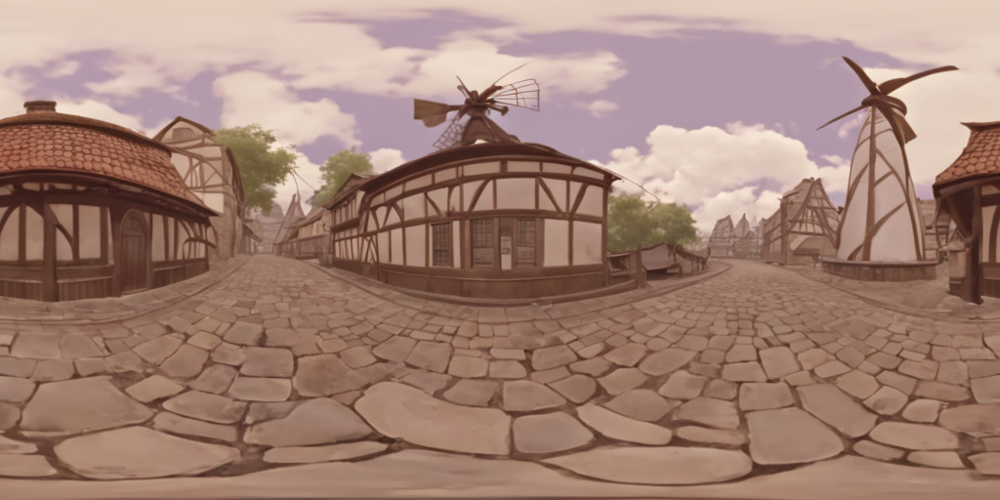

# Yongzhi
Computer vision researcher and engineer with 5 years’ academic and 4 years’ industry experience. I have
developed several popular products on TikTok and CapCut at ByteDance. I am currently working on 3D
reconstruction and scene understanding as the team lead of mixed reality (MR) group in Tencent XR AU-Lab.
I love coding and have been programming using C++ and python for around 9 years. I am passionate on
pursuing excellence, embracing challenges, enjoying work with others, learning new things along the way.

# 3D scene generation using panoramic RGBD diffusion models

## Two stage coarse-to-fine panorama generation

|  Prompt | Panorama RGB | 
| :-----| :----: |
|  For_Honor, The image is a 360-degree panoramic view of a fantasy-themed village, featuring various buildings and structures. The village appears to be located near a body of water, possibly a river or a lake. There are also some trees visible in the background, adding to the overall atmosphere of the scene. |     |
| genshin, The image is a 360-degree panoramic view of a cobblestone street with buildings and a windmill in the background. It appears to be a computer-generated or animated scene, possibly from a video game or virtual world. |  |
|Ghost_Recon, The image is a 360-degree panoramic view of a mountainous landscape with a lake in the foreground. There are several trees and bushes visible in the scene. The image appears to be a digital or computer-generated representation of the landscape, rather than an actual photograph.||
|The image is a 360-degree panoramic view of a bedroom, featuring a large bed, a television, and a window with a view of the city. The room is decorated in a modern style, with wooden floors and white walls. There is also a chair and a lamp in the room. The panoramic view provides an immersive experience, allowing the viewer to take in the entire room and its surroundings.||
|The image is a 360-degree panoramic view of a city street, with buildings and cars visible in the foreground. It appears to be taken from a high vantage point, providing a bird's-eye view of the urban environment.||

## RGBD diffusion 

## Panorama inpainting: Masked image conditional UNet + Manifold constraint training

- Vanilla FT inpainting: Finetune inpainting models using Lora.  
- Our MCT inpainting:  inpainting model trained with Lora and manifold constraint loss.  

   

# Dense 3D reconstruction and scene understanding for VR headset 
**Tencent， Canberra Australia**  
**Senior researcher in computer vision, Team lead of Mixed Reality (MR) group**

- Roadmap of MR: I have designed the first roadmap of MR for Tencent XR AU-Lab based on a
comprehensive evaluation of SOTA methods in stereo depth, multi-view stereo(MVS) and depth fusion. 
- I proposed a pyramid and structural-aware plane-sweep MVS approach, based on SimpleRecon, that achieves a speed improvement from 75ms to 25ms.

|  SimpleRecon |  Structure-aware virtual camera locations | 
| :-----| :----: |
|    |      |

- 3D scene understanding: I am leading the development of a 3D scene understanding system similar to
Apple’s RoomPlan for MR, which detects 3D objects real-time from RGB-D images.

|  Input video |  Multi-view stereo reconstruction |  3D scene understanding |
| :-----| :----: | :----: |
|    |      |     |

## General plan detection

|  Input point cloud |  Plane detection |  Input point cloud |  Plane detection |
| :-----| :----: | :----: | :----: |
|    |      |     |     |

# AR (Augmented reality) Cloud 

## Structure from motion (SFM) of 3D line map

Key contributions:
1. A novel 3D mapping pipeline.   
2. Multi-view triangulation using Plucker representation.   
3. No Manhattan assumption

|  High-precision map for AR |  The pipeline of proposed 3D line mapping approach.|
| :-----| :----: |
|    |     |
| |  |

| |   |   |
| ----------- |  ----------- | ----------- |
| 3D point cloud |  |       |
| 3D line cloud |   |    |
| Reprojections |  |  | 

## Visual positioning system combining features of point and line  
Key contributions: 
- A novel geometric & descriptor fused line matching approach based on coarse VPS pose.

|  VPS (Visual Positioning Service) |  The pipeline of proposed line-based pose verification & refinement.|
| :-----| :----: |
|  ||
| I proposed a new approach of pose refinement by combing deep features of points and lines. The 1st contribution is a structure-aware line detector \& descriptor network, which jointly matches lines and junctions locally. The 2nd one is a fused PnPL-based pose estimator combing line-matching, junction-matching and vanishing points. The localization accuracy (within 1m) has been improved from 91\% to 96\% compared with using points only.  ||

## SuperPoint
I improved the open implementation of SuperPoint which achieve similar performance of the official model.
The recall of MagicLeap can achieve 0.42. However, the recalls of pretrained model of TF_SP and PyTorch_SP are both around 0.145.  I have improved the recall of PyTorch_SP to 0.41.

- Holography augmentation using Thesesus  (https://github.com/facebookresearch/theseus)
- Small rotation (15 to 30 degree)
- Using pseudo GT generated by MagicLeap-SP, instead of MagicPoint in Pytorch_SP 
- An implementation of homograph adaptation based on the original paper, combing within-scale and across-scale.
- Use the Recall to evaluate the performance following "An Evaluation of Feature Matchers for Fundamental Matrix Estimation".

## 3D surface detection from a single view  

Multiple 3D surfaces are detected from a single view.
- No Manhattan assumption
- Unknown camera models 
- 3D normal accuracy > 97% in real world images (around 60% accuracy achieved by SOTA learning and handcrafted methods.)

### Wrap virtual materials on the 3D surfaces:  
- Fully automated and real-time generation of multiple 3D planes from a single view.  
- The layout of multiple planes are optimized based on the scores and distribution of 3D planes.  

| | |
| :-----| :----: |  
|   |     |

## Intelligent advertisement placement

## Scan-to-BIM  
- Input: registered point cloud
- Output: building information models (BIM), which are 3D objects with semantic and structural information.

### FloorDet  

|  |  |
| :-----| :----: |
|  |   |
|  |   |
|  |   |

### CorDet  

|  |  |
| :-----| :----: |
|  |   |
|  |   |
|  |   |
