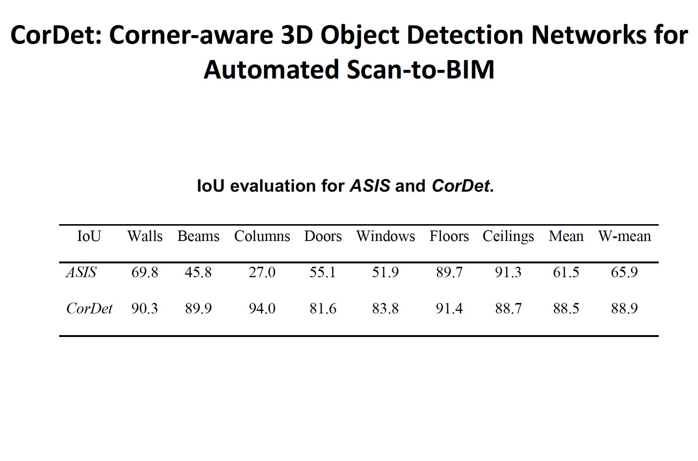

## Yongzhi Xu

## Structure from motion (SFM) of 3D line map

|  Key contributions |  The pipeline of proposed 3D line mapping approach.|
| :-----| :----: |
|   1. A novel 3D mapping pipeline.   2. Multi-view triangulation using Plucker representation.   3. No Manhattan assumption |     |

| |   |   |
| ----------- |  ----------- | ----------- |
| 3D point cloud |  |       |
| 3D line cloud |   |    |
| Reprojections |  |  |

## Visual positioning system combining features of point and line  

|  Key contributions |  The pipeline of proposed line-based pose verification & refinement.|
| :-----| :----: |
|A novel geometric & descriptor fused line matching approach based on coarse VPS pose. ||

## 3D surface detection from a single view  

Multiple 3D surfaces are detected from a single view.
- No Manhattan assumption
- Unknown camera models 
- 3D normal accuracy > 97% in real world images (around 60% accuracy achieved by SOTA learning and handcrafted methods.)

### Wrap virtual materials on the 3D surfaces:  

| | |
| :-----| :----: |
| 1. Fully automated and real-time generation of multiple 3D planes from a single view.   2. The layout of multiple planes are optimized based on the scores and distribution of 3D planes.  |  |

## Scan-to-BIM  
- Input: registered point cloud
- Output: building information models (BIM), which are 3D objects with semantic and structural information.

### FloorDet  

|  |  |
| :-----| :----: |
|  |   |
|  |   |
|  |   |

### CorDet  

|  |  |
| :-----| :----: |
|  |   |
|  |   |
|  |   |
